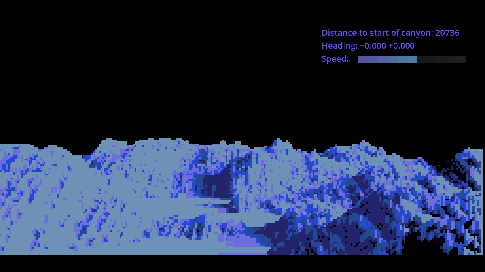

A random collection of experiments with Godot 4.

`fractal-landscape` needs a godot environment with C# support, the other
projects are built using GDscript only.

## airball

Port in progress of the isometric Atari ST game airball using Godot 4's tilemap
system, based on the 25th anniversary edition remake by Clement CORDE.

## descent-font-test

This was an experiment how the `.fnt` (BMFont) font format works in Godot,
carving up an RGB image into font glyphs.

## fractal-landscape

An experiment with using Godot with the C# language. Based on code from
http://bringerp.free.fr/RE/CaptainBlood/main.php5 by Kroah, which is a port of
the fractal landscape renderer used in the Atari ST game Captain Blood. It is an
early example of procedural terrain generation using fractal curves, and rendering
using raytracing, I still quite like how it looks.

The original C# port uses Winforms so only works on Windows, this
port should work on any platform that is supported by Godot with C#
(unfortunately, for now this excludes web).

The C# code exports a paletted image every frame, palette mapping is done in
postprocessing with a pixel shader. The HUD is rendered on top by the Godot UI
framework.

Controls:

- `LMB`+drag left/right: movement left/right
- `LMB`+drag up/down: movement up/down
- `RMB`+drag up/down: increase and decrease speed
- `Space`: Change renderer wireframe/raytracer
- `B`: "blue" raytracer
- `P`: Pause/unpause game
- `Esc`: Quit
- `F12`: Screenshot

## Wireframe

Experiment with opaque wireframe rendering using shaders. A custom exporter from
blender is provided that marks inner triangle edges (edges on a flat surface)
as invisible, for a less cluttered view.

